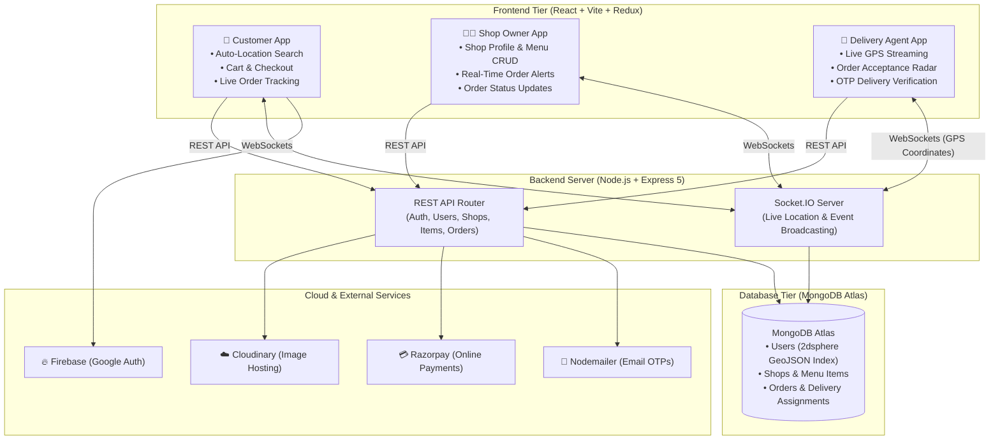

# 🍔 FoodieWe - Real-Time Food Delivery Platform

Welcome to **FoodieWe**! This is a complete, real-time food delivery application built using the MERN stack (MongoDB, Express, React, Node.js). 

It connects hungry customers, local shop owners, and delivery agents together with real-time location tracking and secure online payments.

---

## 🏛️ System Architecture



---

## 🚀 Features

The system has three specialized dashboards depending on who logs in:

### 1. For Customers (Users)
*   **Auto-Location Proximity**: The app detects your city using your browser's GPS and automatically filters shops and food items near you.
*   **Food Shopping & Cart**: Search for meals, filter by categories, customize your cart, and check out.
*   **Secure Checkout**: Pay instantly online using the integrated **Razorpay** payment gateway or choose Cash on Delivery (COD).
*   **Live Order Tracking**: Watch your delivery boy move on an interactive Leaflet map in real-time as they bring your food.

### 2. For Shop Owners
*   **Shop Management**: Create your shop, upload banner images, and set up your details.
*   **Menu CRUD**: Easily add, edit, or delete items on your menu (complete with pricing, description, and images).
*   **Order Center**: Receive real-time orders, accept them, prepare them, and transition them to "out for delivery" to automatically dispatch to nearby delivery agents.

### 3. For Delivery Agents
*   **Order Alerts**: Get notified of new broadcasted delivery assignments within a 5km radius.
*   **Live Geolocation**: Stream your active location coordinates to the customer using WebSockets as you ride.
*   **OTP-Verified Deliveries**: Complete deliveries safely by verifying a unique 4-digit OTP sent to the customer's email.

---

## 🛠️ The Tech Stack

*   **Frontend**: React.js (Vite), Redux Toolkit (state management), React Router DOM (navigation), Tailwind CSS (styling), React Leaflet (maps), Recharts (earnings analytics).
*   **Backend**: Node.js, Express.js, Socket.io (WebSocket connections for real-time tracking).
*   **Database**: MongoDB & Mongoose (with Geospatial 2dsphere indexing for location matching).
*   **Security & Cloud**: JSON Web Tokens (JWT) for sessions, bcryptjs for password security, Cloudinary API for image uploads, Nodemailer for OTPs, and Firebase Auth for Google Sign-In.

---

## 💻 Running it Locally

Follow these steps to run FoodieWe on your computer:

### 1. Clone the project
```bash
git clone https://github.com/shwetang01/FoodieWe.git
cd FoodieWe
```

### 2. Set up the Backend
1. Go into the backend directory and install dependencies:
   ```bash
   cd backend
   npm install
   ```
2. Create a `.env` file in the `backend` folder and add the following keys:
   ```env
   PORT=8000
   MONGODB_URL="your-mongodb-connection-string"
   JWT_SECRET="your-jwt-secret-string"
   
   # Nodemailer configurations for OTPs
   EMAIL="your-email@gmail.com"
   PASS="your-app-password"
   
   # Cloudinary for file uploads
   CLOUDINARY_CLOUD_NAME="your-cloudinary-name"
   CLOUDINARY_API_KEY="your-cloudinary-key"
   CLOUDINARY_API_SECRET="your-cloudinary-secret"
   
   # Razorpay for payments
   RAZORPAY_KEY_ID="your-razorpay-key-id"
   RAZORPAY_KEY_SECRET="your-razorpay-key-secret"
   ```
3. Start the backend server:
   ```bash
   npm run dev
   ```

### 3. Set up the Frontend
1. Open a new terminal window, go into the frontend directory, and install dependencies:
   ```bash
   cd frontend
   npm install
   ```
2. Create a `.env` file in the `frontend` folder and add your API keys:
   ```env
   VITE_FIREBASE_APIKEY="your-firebase-api-key"
   VITE_GEOAPIKEY="your-geo-location-api-key"
   VITE_RAZORPAY_KEY_ID="your-razorpay-key-id"
   ```
3. Start the Vite dev server:
   ```bash
   npm run dev
   ```

Now open `http://localhost:5173` in your browser to see the app!
